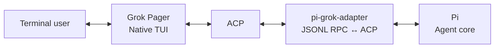
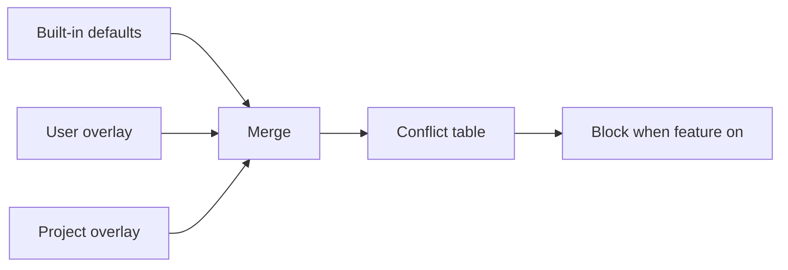

# grok-pi — Remote TUI bridge for Pi and Grok Build

> Pi agent core in Grok Build's native terminal UI.

[Download latest release](https://github.com/Dwsy/grok-pi/releases/latest) · [ZH](docs/README.zh-CN.md) · [Feature matrix](docs/FEATURE_MATRIX.md) · [Architecture](docs/NATIVE_GROK_TUI_ALIGNMENT.md) · [Verification](docs/VERIFICATION.md) · [Changelog](CHANGELOG.MD) · [更新日志](docs/CHANGELOG.zh-CN.md)

> **Remote TUI bridge.** Pi's interactive components render through Grok Build's native Pager, preserving the Grok terminal experience while exposing Pi's extension ecosystem. Pi users get Grok Build's native UI; Grok Build users get Pi's models, tools, sessions, and extensions.

`grok-pi` combines Pi's agent runtime with Grok Build's native Pager. Pi remains responsible for models, tools, extensions, sessions, and agent execution. Grok Pager remains the only terminal UI.

## Install

### macOS / Linux

```bash
curl -fsSL https://github.com/Dwsy/grok-pi/releases/latest/download/install.sh | sh
```

### Windows

```powershell
irm https://github.com/Dwsy/grok-pi/releases/latest/download/install.ps1 | iex
```

The installer picks the matching release asset and installs `grok-pi`:

| Platform | Asset |
|---|---|
| macOS Apple Silicon | `grok-pi-macos-aarch64.tar.gz` |
| macOS Intel | `grok-pi-macos-x86_64.tar.gz` |
| Linux x86_64 | `grok-pi-linux-x86_64.tar.gz` |
| Linux ARM64 | `grok-pi-linux-aarch64.tar.gz` |
| Windows x64 | `grok-pi-windows-x86_64.zip` |
| Windows ARM64 | `grok-pi-windows-aarch64.zip` |

Defaults: Unix → `~/.local/bin`; Windows → `%LOCALAPPDATA%\grok-pi\bin`. Override with `GROK_PI_INSTALL_DIR`. Pin with `GROK_PI_VERSION=vX.Y.Z`.

The installer also creates `pig` and `pi-grok` aliases (Unix symlinks; Windows `pig.exe` / `pi-grok.exe` hardlinks with copy fallback):

```bash
grok-pi --help   # original name
pig --help       # short alias
pi-grok --help   # alias
```

`grok-pi` requires [Pi](https://pi.dev) **0.84.3 or newer** (system `pi` / pi.dev installer):

```bash
# recommended
curl -fsSL https://pi.dev/install.sh | sh
# Windows:
# powershell -c "irm https://pi.dev/install.ps1 | iex"
# or npm:
npm install --global @earendil-works/pi-coding-agent
```

On Windows, if an older `grok-pi.exe` cannot find bare `pi`, point it at the shim:

```powershell
$env:PI_BIN = "$env:LOCALAPPDATA\pi-node\current\pi.cmd"
grok-pi --pi-bin $env:PI_BIN
```

## Start

From any project directory:

```bash
grok-pi
# or
pig
# or
pi-grok
```

Defaults: system `pi` on PATH, current working directory as the project. Continue the previous session with `grok-pi --continue`.

Useful commands:

```bash
grok-pi --help
grok-pi update --check
grok-pi update
```

## What it provides

| Area | Included |
|---|---|
| Agent runtime | Pi models, providers, tools, extensions, skills, sessions, retries, and compaction |
| Model management | `/pi-models` provides a native Provider → Model → Details editor with safe `models.json` transactions, backup/restore, live Pi reload, and typed activation; `/model` remains the fast switcher |
| Terminal UI | Grok Pager input, slash completion, Markdown, tool cards, diffs, dialogs, and scrollback |
| Product tutorial | `/tutorial` (aliases `/tour`, `/onboarding`) opens 18 grok-pi capability areas: native Pager workflows, Pi providers/models/tools/sessions, the extension/Skill/Package ecosystem, product bridges, optional automation and explicit boundaries |
| **Remote TUI bridge** | Pi `ctx.ui.custom` components rendered through Grok Build's native Pager, without a second TUI |
| Shell execution | Bash integration, background tasks, output limits, timeouts, and process-tree cleanup |
| Parallel work | Pi sub-agents with foreground/background execution and native task views; `/subagents` exposes built-ins plus product-isolated project/global overrides. Optional Subagents V2 (F2 → Agent → "Pi subagents V2", or `PI_GROK_SUBAGENTS_V2=1`) adds root-session-scoped stable `/root/...` agent paths, parent/child + peer messaging, nested spawn, and external team presets under `.grok-pi/teams` / `~/.grok-pi/teams` |
| Rhai workflows | Upstream `xai-workflow` host (F2 **Pi workflows**); `/workflow`, `/workflows`, `/create-workflow`; scripts under `~/.grok-pi/workflows` and `<repo>/.grok-pi/workflows` |
| Session workflow | Resume, tree navigation, labels, recap, context inspection, and session picker |
| Resource management | Native manager for Pi extensions, skills, prompts, and themes |
| Updates | GitHub Releases-based update check and installation |

For field-level behavior and intentional omissions, see the [feature matrix](docs/FEATURE_MATRIX.md).

## Architecture



The integration has three boundaries:

- **Grok Pager** owns terminal lifecycle, input, rendering, dialogs, and visible UI.
- **Pi** owns the agent loop, models, providers, tools, extensions, and sessions.
- **`pi-grok-adapter`** is a headless JSONL RPC ↔ ACP bridge. It does not own a terminal or render a second UI.

Pi source is not modified. The Remote TUI bridge connects capabilities unavailable in Pi RPC through the official extension API and projects them onto native Pager surfaces.

## Configuration

Bundled bridge extensions are enabled by default where stable. Experimental native commands are opt-in.

| Variable | Default | Purpose |
|---|---:|---|
| `PI_GROK_REMOTE_TUI` | `1` | Enable Pi `ctx.ui.custom` components |
| `PI_GROK_BASH` | `1` | Enable Grok-owned Bash integration |
| `PI_GROK_NATIVE_COMMANDS` | `0` | Enable experimental `/pi-*` commands |
| `PI_GROK_SUBAGENTS_V2` | `0` | Enable optional V2 team tools (`spawn_team`, stable agent paths, peer messaging, nested spawn) on top of Pi subagents |
| `GROK_HOME` | `~/.grok-pi` | User state root (isolated from stock Grok `~/.grok`) |
| `GROK_PROJECT_DIR` | `.grok-pi` | Project config/workflows/hooks dir name under repo root |
| `GROK_PI_NO_AUTO_UPDATE` | unset | Disable background update checks |

Subagents V2 team presets are JSON files under `<repo>/.grok-pi/teams` or `~/.grok-pi/teams` (project overrides global, which overrides bundled presets). Agent profiles remain external Markdown under the matching `agents/` directories. Example:

```json
{
  "name": "implementation",
  "description": "Implementation plus review",
  "members": [
    { "name": "implementer", "agent": "general-purpose", "task": "Implement: {{task}}" },
    { "name": "reviewer", "agent": "explore", "task": "Review: {{task}}" }
  ]
}
```

Enable V2 before starting grok-pi with the F2 "Pi subagents V2" toggle or `PI_GROK_SUBAGENTS_V2=1`; use `/subagent-teams` to inspect presets. `spawn_team` starts a preset, while `spawn_team_agent`, `team_send_message`, `team_followup_task`, `team_wait`, `team_list`, and `team_interrupt` provide the lower-level collaboration surface. Rhai Workflow remains the deterministic orchestration engine; Team V2 is the session-scoped, run-reusable agent identity/messaging layer.

Rhai workflows are **off by default** (F2 → Agent → **Pi workflows**, then full restart). Details: [FEATURE_MATRIX.md](docs/FEATURE_MATRIX.md), [AGENTS.md](AGENTS.md#product-state-isolation).

Herdr lifecycle reporting is **off by default**. Enable it with F2 → Agent → **Pi Herdr integration**, then restart. See the [Herdr setup guide](docs/usage/grok-pi-herdr.md).

Use `--no-extensions` (`-ne`) to disable Pi extension auto-discovery; explicit `-e` paths and grok-pi host bridges still load. Use `--no-bridge-extensions` to disable the bundled host bridges, or combine both flags for a fully extension-free launch. Pi startup options can be passed directly after `--`.

```bash
grok-pi -- --model openai/gpt-4o
```

## Build from source

Requirements: Rust **1.92.0**, Node.js **22.19.0 or newer**, npm, and a system Pi installation.

```bash
./build.sh
./target/debug/grok-pi
# or: PI_BIN=pi ./run-local.sh
```

Project Cargo commands should go through `./scripts/cargo-shared.sh`: incremental
compilation is enabled by default, the generated target is capped at 128 GiB, and
Cargo stops before free space falls below 20 GiB. Override the target cap with
`CARGO_TARGET_MAX_GIB`; periodic maintenance clears incremental caches first and runs
`cargo clean` if an already-over-cap target remains too large. Override
`CARGO_MIN_FREE_GIB` only deliberately; set `CARGO_MAINTENANCE=0` to skip one
pre-command maintenance pass. The running disk guard continuously enforces the
free-space floor; target-size maintenance runs on its configured cadence.

Run verification with:

```bash
./verify.sh
```

See [VERIFICATION.md](docs/VERIFICATION.md) for the distinction between static checks and runtime acceptance.

## Documentation

- [Feature matrix](docs/FEATURE_MATRIX.md) — supported behavior and intentional boundaries
- [Subagents V2 guide](docs/usage/subagents-v2.md) — opt-in team collaboration, stable paths, presets, queue semantics, rollback, and troubleshooting
- [Architecture alignment](docs/NATIVE_GROK_TUI_ALIGNMENT.md) — component ownership, protocol mapping, and migration guidance
- [Verification record](docs/VERIFICATION.md) — completed checks and known environment blockers
- [Changelog](CHANGELOG.MD) / [更新日志](docs/CHANGELOG.zh-CN.md) — release history (EN / ZH)
- [Contributing](CONTRIBUTING.md) — contribution guidelines

## License

See [LICENSE](LICENSE) and [THIRD-PARTY-NOTICES](THIRD-PARTY-NOTICES) for project and upstream notices.

## Native feature switches → blocked Pi extensions

When a native grok-pi capability is **on**, the host resource policy may block known conflicting Pi packages so tool names / roles do not collide. Built-in defaults live in [`crates/codegen/xai-grok-pager/assets/native_feature_conflicts.toml`](crates/codegen/xai-grok-pager/assets/native_feature_conflicts.toml). Runtime overlays (no rebuild): `$GROK_HOME/native-feature-conflicts.toml`, then `$GROK_PROJECT_DIR/native-feature-conflicts.toml` (package **union**; non-empty `reason` overwrites). User resource `allow` still wins.



| Feature switch | How it turns on | Default | Blocks (npm packages) |
|---|---|---:|---|
| **Q&A** (`pi_ask_user_question`) | F2 → Agent → Q&A (restart) | off | `@juicesharp/rpiv-ask-user-question` |
| **Q&A desktop notifications** (`pi_ask_user_question_notifications`) | F2 → Agent → Q&A desktop notifications | on | — |
| **Pi goal mode** (`pi_goal`) | F2 → Agent → Pi goal mode (restart) | off | `pi-codex-goal`, `@narumitw/pi-goal`, `@misunders2d/pi-goal`, `pi-goal`, `pi-goal-x` |
| **Pi workflows** (`pi_workflows`) | F2 → Agent → Pi workflows (restart) | off | `@quintinshaw/pi-dynamic-workflows` |
| **Pi subagents** (`pi_subagents`) | F2 → Agent → Pi subagents (restart) | on | `pi-subagents`, `@tintinweb/pi-subagents`; native `/subagents` config writes isolated global/project Markdown definitions. Optional V2 is separately enabled with the F2 "Pi subagents V2" toggle or `PI_GROK_SUBAGENTS_V2=1`; `/subagent-teams` discovers project/global/bundled JSON presets |
| **`/btw`** (`pi_btw`) | F2 → Agent → Pi /btw (restart); saved answers are viewable with `/btw-history` | off | `pi-btw`, `@narumitw/pi-btw`, `@juicesharp/rpiv-btw` |
| **Markdown user messages** (`pi_user_markdown`) | F2 → Agent → Markdown user messages | on | — |

Eval bridge generations are mutually exclusive and selected at process start. Eval v1 remains the default. Eval Bridge v2 can expose JavaScript, Python, or both:

```toml
[ui]
pi_eval = "v2"
pi_eval_v2_language = "all"       # "js" (default), "py", or "all"
pi_eval_v2_display_mode = "effects" # "effects" (default) or "legacy"
```

Use `pi_eval = "v1"` (or omit the key) for legacy Eval. Eval v1 keeps persistent Python and JavaScript kernels; Eval Bridge v2 uses isolated cells with explicit `store/load` persistence and the selected language set. Because `pi_eval` is a single version selector, v1 and v2 cannot run concurrently. `pi_eval` and `pi_eval_v2_language` are restart-required.

`pi_eval_v2_display_mode` is presentation-only and applies immediately: `effects` keeps Eval v2 orchestration source out of the normal transcript and presents its effects/results, while `legacy` restores source + result rendering. Change it from **F2 → Agent → Eval v2 display**, edit `[ui].pi_eval_v2_display_mode`, or use `/eval-display [effects|legacy]`; `/eval-display` with no argument toggles the current mode. The selected mode is persisted for future sessions.

Turning Pi subagents off omits the bundled bridge, forces `PI_GROK_SUBAGENTS=0`, and admits conflicting third-party packages again for the next process.

F2 descriptions for the opt-in rows append **When on, blocks: …** from the same table.
